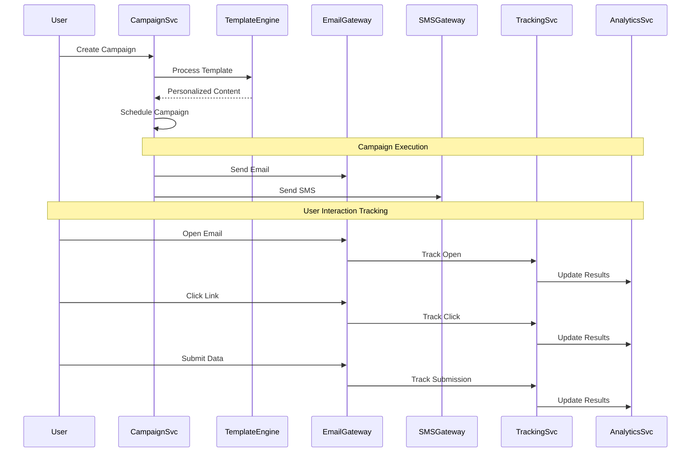

# Email/SMS Campaign Simulation System

## Overview
The campaign simulation system is the core functionality of the Phishing Trainer application. It creates realistic phishing simulations through email and SMS, tracks user interactions, and provides educational feedback to help users recognize real threats.

## Campaign Architecture

### Campaign Execution Flow


### Campaign Service Implementation
```csharp
public class CampaignService
{
    private readonly ApplicationDbContext _context;
    private readonly IEmailService _emailService;
    private readonly ISmsService _smsService;
    private readonly ITemplateEngine _templateEngine;
    private readonly ITrackingService _trackingService;
    private readonly ILogger<CampaignService> _logger;

    public async Task<CampaignResult> CreateCampaignAsync(CreateCampaignRequest request, string ownerId)
    {
        try
        {
            var campaign = new Campaign
            {
                Id = Guid.NewGuid().ToString(),
                Name = request.Name,
                Description = request.Description,
                OwnerId = ownerId,
                Type = request.Type,
                Status = CampaignStatus.Draft,
                ScheduledAt = request.ScheduledAt,
                Template = await _context.PhishingTemplates.FindAsync(request.TemplateId)
            };

            // Create campaign targets
            foreach (var targetRequest in request.Targets)
            {
                var target = new CampaignTarget
                {
                    Id = Guid.NewGuid().ToString(),
                    CampaignId = campaign.Id,
                    TargetUserId = targetRequest.UserId,
                    EmailAddress = targetRequest.EmailAddress,
                    PhoneNumber = targetRequest.PhoneNumber
                };
                campaign.Targets.Add(target);
            }

            _context.Campaigns.Add(campaign);
            await _context.SaveChangesAsync();

            return CampaignResult.Success(campaign);
        }
        catch (Exception ex)
        {
            _logger.LogError(ex, "Failed to create campaign for user {OwnerId}", ownerId);
            return CampaignResult.Failed("Failed to create campaign");
        }
    }

    public async Task<CampaignResult> StartCampaignAsync(string campaignId)
    {
        var campaign = await _context.Campaigns
            .Include(c => c.Targets)
            .Include(c => c.Template)
            .FirstOrDefaultAsync(c => c.Id == campaignId);

        if (campaign == null)
            return CampaignResult.Failed("Campaign not found");

        try
        {
            campaign.Status = CampaignStatus.Active;
            campaign.StartedAt = DateTime.UtcNow;

            foreach (var target in campaign.Targets)
            {
                await ProcessCampaignTargetAsync(campaign, target);
            }

            await _context.SaveChangesAsync();
            return CampaignResult.Success(campaign);
        }
        catch (Exception ex)
        {
            _logger.LogError(ex, "Failed to start campaign {CampaignId}", campaignId);
            return CampaignResult.Failed("Failed to start campaign");
        }
    }

    private async Task ProcessCampaignTargetAsync(Campaign campaign, CampaignTarget target)
    {
        try
        {
            // Generate personalized content
            var personalizedContent = await _templateEngine.ProcessTemplateAsync(
                campaign.Template, 
                target, 
                campaign);

            // Send email if enabled
            if (campaign.Type == CampaignType.Email || campaign.Type == CampaignType.Both)
            {
                await SendPhishingEmailAsync(target, personalizedContent);
                target.EmailSent = true;
            }

            // Send SMS if enabled
            if (campaign.Type == CampaignType.SMS || campaign.Type == CampaignType.Both)
            {
                await SendPhishingSmsAsync(target, personalizedContent);
                target.SmsSent = true;
            }

            target.SentAt = DateTime.UtcNow;

            // Initialize result tracking
            var result = new CampaignResult
            {
                Id = Guid.NewGuid().ToString(),
                CampaignId = campaign.Id,
                UserId = target.TargetUserId,
                Result = ResultType.DeliveredNotOpened,
                Score = 0
            };

            _context.CampaignResults.Add(result);
        }
        catch (Exception ex)
        {
            _logger.LogError(ex, "Failed to process target {TargetId} for campaign {CampaignId}", 
                target.Id, campaign.Id);
        }
    }

    private async Task SendPhishingEmailAsync(CampaignTarget target, PersonalizedContent content)
    {
        var emailRequest = new EmailRequest
        {
            To = target.EmailAddress,
            Subject = content.EmailSubject,
            HtmlBody = content.EmailBody,
            TextBody = content.TextEmailBody,
            TrackingPixelUrl = GenerateTrackingPixelUrl(target.Id, "open"),
            Links = content.TrackingLinks.ToDictionary(
                kvp => kvp.Key,
                kvp => GenerateTrackingUrl(target.Id, kvp.Value, "click"))
        };

        await _emailService.SendPhishingEmailAsync(emailRequest);
    }

    private async Task SendPhishingSmsAsync(CampaignTarget target, PersonalizedContent content)
    {
        var smsRequest = new SmsRequest
        {
            To = target.PhoneNumber,
            Message = content.SmsContent,
            TrackingUrl = GenerateTrackingUrl(target.Id, content.SmsLink, "sms_click")
        };

        await _smsService.SendPhishingSmsAsync(smsRequest);
    }
}
```

## Template Engine

### Template Processing
```csharp
public class TemplateEngine
{
    private readonly ILogger<TemplateEngine> _logger;
    private readonly IUserService _userService;

    public async Task<PersonalizedContent> ProcessTemplateAsync(
        PhishingTemplate template, 
        CampaignTarget target, 
        Campaign campaign)
    {
        var user = await _userService.GetUserAsync(target.TargetUserId);
        var variables = new Dictionary<string, string>
        {
            ["{{user.firstName}}"] = user.FirstName,
            ["{{user.lastName}}"] = user.LastName,
            ["{{user.email}}"] = user.Email,
            ["{{campaign.name}}"] = campaign.Name,
            ["{{tracking.open}}"] = GenerateTrackingPixelUrl(target.Id, "open"),
            ["{{tracking.unsubscribe}}"] = GenerateTrackingUrl(target.Id, "", "unsubscribe")
        };

        var personalizedContent = new PersonalizedContent
        {
            EmailSubject = ReplaceVariables(template.Subject, variables),
            EmailBody = ReplaceVariables(template.BodyContent, variables),
            SmsContent = ReplaceVariables(template.SmsContent, variables),
            LandingPageUrl = GenerateLandingPageUrl(target.Id, template.LandingPageUrl)
        };

        // Process tracking links in email body
        personalizedContent.TrackingLinks = ExtractAndReplaceLinks(
            personalizedContent.EmailBody, 
            target.Id);

        return personalizedContent;
    }

    private string ReplaceVariables(string content, Dictionary<string, string> variables)
    {
        foreach (var variable in variables)
        {
            content = content.Replace(variable.Key, variable.Value);
        }
        return content;
    }

    private Dictionary<string, string> ExtractAndReplaceLinks(string htmlContent, string targetId)
    {
        var trackingLinks = new Dictionary<string, string>();
        var linkPattern = @"href=[""']([^""']+)[""']";
        var matches = Regex.Matches(htmlContent, linkPattern);

        foreach (Match match in matches)
        {
            var originalUrl = match.Groups[1].Value;
            var trackingUrl = GenerateTrackingUrl(targetId, originalUrl, "click");
            trackingLinks[originalUrl] = trackingUrl;
            htmlContent = htmlContent.Replace(match.Value, $"href=\"{trackingUrl}\"");
        }

        return trackingLinks;
    }

    private string GenerateTrackingUrl(string targetId, string originalUrl, string action)
    {
        var baseUrl = _config["App:BaseUrl"];
        var encodedUrl = Uri.EscapeDataString(originalUrl);
        return $"{baseUrl}/track/{targetId}?action={action}&url={encodedUrl}";
    }

    private string GenerateTrackingPixelUrl(string targetId, string action)
    {
        var baseUrl = _config["App:BaseUrl"];
        return $"{baseUrl}/track/{targetId}?action={action}&pixel=1";
    }

    private string GenerateLandingPageUrl(string targetId, string originalUrl)
    {
        var baseUrl = _config["App:BaseUrl"];
        return $"{baseUrl}/landing/{targetId}?original={Uri.EscapeDataString(originalUrl)}";
    }
}

public class PersonalizedContent
{
    public string EmailSubject { get; set; }
    public string EmailBody { get; set; }
    public string TextEmailBody { get; set; }
    public string SmsContent { get; set; }
    public string LandingPageUrl { get; set; }
    public Dictionary<string, string> TrackingLinks { get; set; }
    public string SmsLink { get; set; }
}
```

## Email Service Integration

### Email Gateway
```csharp
public interface IEmailService
{
    Task SendPhishingEmailAsync(EmailRequest request);
    Task SendEducationalEmailAsync(string to, string subject, string content);
}

public class SendGridEmailService : IEmailService
{
    private readonly ISendGridClient _client;
    private readonly ILogger<SendGridEmailService> _logger;

    public async Task SendPhishingEmailAsync(EmailRequest request)
    {
        var message = new SendGridMessage
        {
            From = new EmailAddress(_config["PhishingEmail:From"], _config["PhishingEmail:FromName"]),
            Subject = request.Subject,
            HtmlContent = request.HtmlBody,
            TextContent = request.TextEmailBody
        };

        message.AddTo(request.To);

        // Add custom headers for tracking
        message.Headers = new Dictionary<string, string>
        {
            ["X-Campaign-Target-Id"] = request.TargetId,
            ["X-Campaign-Type"] = "phishing-simulation"
        };

        // Add tracking pixel
        if (!string.IsNullOrEmpty(request.TrackingPixelUrl))
        {
            request.HtmlBody += $"";
        }

        try
        {
            var response = await _client.SendEmailAsync(message);
            
            if (response.IsSuccessStatusCode)
            {
                _logger.LogInformation("Phishing email sent successfully to {Email}", request.To);
            }
            else
            {
                _logger.LogError("Failed to send phishing email to {Email}: {Error}", 
                    request.To, await response.Body.ReadAsStringAsync());
            }
        }
        catch (Exception ex)
        {
            _logger.LogError(ex, "Exception sending phishing email to {Email}", request.To);
            throw;
        }
    }
}

public class EmailRequest
{
    public string To { get; set; }
    public string Subject { get; set; }
    public string HtmlBody { get; set; }
    public string TextEmailBody { get; set; }
    public string TrackingPixelUrl { get; set; }
    public Dictionary<string, string> Links { get; set; }
    public string TargetId { get; set; }
}
```

## SMS Service Integration

### SMS Gateway
```csharp
public interface ISmsService
{
    Task SendPhishingSmsAsync(SmsRequest request);
    Task SendEducationalSmsAsync(string to, string message);
}

public class TwilioSmsService : ISmsService
{
    private readonly TwilioClient _twilioClient;
    private readonly ILogger<TwilioSmsService> _logger;

    public async Task SendPhishingSmsAsync(SmsRequest request)
    {
        try
        {
            var messageOptions = new CreateMessageOptions(
                new PhoneNumber(request.To))
            {
                From = new PhoneNumber(_config["Twilio:FromNumber"]),
                Body = request.Message,
                StatusCallback = new Uri($"{_config["App:BaseUrl"]}/api/sms/status-callback")
            };

            var message = await MessageResource.CreateAsync(messageOptions);
            
            _logger.LogInformation("Phishing SMS sent to {Phone}, SID: {Sid}", 
                request.To, message.Sid);

            // Store message SID for tracking
            await StoreMessageTrackingAsync(request.TargetId, message.Sid);
        }
        catch (Exception ex)
        {
            _logger.LogError(ex, "Failed to send phishing SMS to {Phone}", request.To);
            throw;
        }
    }

    private async Task StoreMessageTrackingAsync(string targetId, string messageSid)
    {
        // Store the Twilio message SID for status tracking
        var tracking = new SmsTracking
        {
            TargetId = targetId,
            MessageSid = messageSid,
            SentAt = DateTime.UtcNow
        };

        _context.SmsTracking.Add(tracking);
        await _context.SaveChangesAsync();
    }
}

public class SmsRequest
{
    public string To { get; set; }
    public string Message { get; set; }
    public string TrackingUrl { get; set; }
    public string TargetId { get; set; }
}
```

## Tracking System

### Interaction Tracking
```csharp
public class TrackingController : ControllerBase
{
    private readonly ITrackingService _trackingService;
    private readonly ILogger<TrackingController> _logger;

    [HttpGet("/track/{targetId}")]
    [AllowAnonymous]
    public async Task<IActionResult> TrackInteraction(string targetId, [FromQuery] string action, [FromQuery] string url, [FromQuery] int pixel = 0)
    {
        try
        {
            var target = await _context.CampaignTargets
                .Include(t => t.Campaign)
                .FirstOrDefaultAsync(t => t.Id == targetId);

            if (target == null)
                return NotFound();

            await _trackingService.TrackInteractionAsync(targetId, action, url, Request);

            if (pixel == 1)
            {
                // Return 1x1 transparent pixel for email open tracking
                return File(Convert.FromBase64String("R0lGODlhAQABAIAAAAAAAP///yH5BAEAAAAALAAAAAABAAEAAAIBRAA7"), "image/gif");
            }

            if (action == "click" && !string.IsNullOrEmpty(url))
            {
                // Redirect to original URL for link clicks
                return Redirect(url);
            }

            return Ok();
        }
        catch (Exception ex)
        {
            _logger.LogError(ex, "Failed to track interaction for target {TargetId}", targetId);
            return StatusCode(500);
        }
    }

    [HttpGet("/landing/{targetId}")]
    [AllowAnonymous]
    public async Task<IActionResult> LandingPage(string targetId, [FromQuery] string original)
    {
        try
        {
            var target = await _context.CampaignTargets
                .Include(t => t.Campaign)
                .ThenInclude(c => c.Template)
                .FirstOrDefaultAsync(t => t.Id == targetId);

            if (target == null)
                return NotFound();

            // Track landing page visit
            await _trackingService.TrackLandingPageVisitAsync(targetId, Request);

            // Show educational landing page
            var model = new LandingPageViewModel
            {
                CampaignName = target.Campaign.Name,
                IsSimulation = true,
                EducationalContent = await GetEducationalContentAsync(target.Campaign.Template.Difficulty),
                OriginalUrl = original
            };

            return View("LandingPage", model);
        }
        catch (Exception ex)
        {
            _logger.LogError(ex, "Failed to show landing page for target {TargetId}", targetId);
            return StatusCode(500);
        }
    }
}

public class TrackingService
{
    private readonly ApplicationDbContext _context;
    private readonly ILogger<TrackingService> _logger;

    public async Task TrackInteractionAsync(string targetId, string action, string url, HttpRequest request)
    {
        var result = await _context.CampaignResults
            .FirstOrDefaultAsync(r => r.CampaignTargetId == targetId);

        if (result == null) return;

        var userAgent = request.Headers["User-Agent"].ToString();
        var ipAddress = GetClientIpAddress(request);
        var timestamp = DateTime.UtcNow;

        switch (action.ToLower())
        {
            case "open":
                if (result.EmailOpenedAt == default)
                {
                    result.EmailOpenedAt = timestamp;
                    result.Result = ResultType.OpenedNoClick;
                    result.Score = CalculateScore(result.Result);
                }
                break;

            case "click":
                if (result.LinkClickedAt == default)
                {
                    result.LinkClickedAt = timestamp;
                    result.ClickedLinkUrl = url;
                    result.Result = ResultType.ClickedNoSubmit;
                    result.Score = CalculateScore(result.Result);
                }
                break;

            case "sms_click":
                if (result.SmsClickedAt == default)
                {
                    result.SmsClickedAt = timestamp;
                    result.ClickedLinkUrl = url;
                    result.Result = ResultType.ClickedNoSubmit;
                    result.Score = CalculateScore(result.Result);
                }
                break;
        }

        // Log detailed tracking information
        var trackingLog = new InteractionLog
        {
            TargetId = targetId,
            Action = action,
            Url = url,
            UserAgent = userAgent,
            IpAddress = ipAddress,
            Timestamp = timestamp
        };

        _context.InteractionLogs.Add(trackingLog);
        await _context.SaveChangesAsync();
    }

    public async Task TrackLandingPageVisitAsync(string targetId, HttpRequest request)
    {
        var result = await _context.CampaignResults
            .FirstOrDefaultAsync(r => r.CampaignTargetId == targetId);

        if (result == null) return;

        result.LandingPageVisitedAt = DateTime.UtcNow;
        result.Result = ResultType.ClickedNoSubmit;
        result.Score = CalculateScore(result.Result);

        await _context.SaveChangesAsync();
    }

    private int CalculateScore(ResultType result)
    {
        return result switch
        {
            ResultType.NotDelivered => 0,
            ResultType.DeliveredNotOpened => 25,
            ResultType.OpenedNoClick => 50,
            ResultType.ClickedNoSubmit => 75,
            ResultType.SubmittedData => 100,
            ResultType.ReportedAsPhishing => 100,
            _ => 0
        };
    }

    private string GetClientIpAddress(HttpRequest request)
    {
        var forwardedFor = request.Headers["X-Forwarded-For"].FirstOrDefault();
        if (!string.IsNullOrEmpty(forwardedFor))
        {
            return forwardedFor.Split(',')[0].Trim();
        }

        return request.HttpContext.Connection.RemoteIpAddress?.ToString() ?? "Unknown";
    }
}
```

## Template Library

### Pre-built Phishing Templates
```csharp
public class PhishingTemplateSeeder
{
    public async Task SeedTemplatesAsync()
    {
        var templates = new List<PhishingTemplate>
        {
            new PhishingTemplate
            {
                Name = "Bank Account Verification",
                Description = "Urgent request to verify bank account details",
                Subject = "Urgent: Verify Your Bank Account Immediately",
                BodyContent = @"
                    <h2>Account Verification Required</h2>
                    <p>Dear {{user.firstName}},</p>
                    <p>We've detected suspicious activity on your account. Please verify your information immediately to prevent account suspension.</p>
                    <p><a href='https://secure-bank-verification.com/verify'>Verify Account Now</a></p>
                    <p>This link expires in 24 hours.</p>
                ",
                SmsContent = "URGENT: Your bank account has been suspended. Click here to verify: {{tracking.link}}",
                LandingPageUrl = "https://secure-bank-verification.com/verify",
                Difficulty = DifficultyLevel.Easy,
                Category = "Financial",
                IsCustom = false
            },
            new PhishingTemplate
            {
                Name = "Package Delivery Notification",
                Description = "Fake delivery notification with tracking link",
                Subject = "Your Package Delivery - Action Required",
                BodyContent = @"
                    <h2>Package Delivery Update</h2>
                    <p>Hi {{user.firstName}},</p>
                    <p>We attempted to deliver your package but need additional information. Please confirm your delivery address:</p>
                    <p><a href='https://delivery-confirm.com/track'>Track Package</a></p>
                    <p>Tracking Number: 1Z999AA1234567890</p>
                ",
                SmsContent = "Your package is held at our facility. Confirm address for delivery: {{tracking.link}}",
                LandingPageUrl = "https://delivery-confirm.com/track",
                Difficulty = DifficultyLevel.Medium,
                Category = "Delivery",
                IsCustom = false
            },
            new PhishingTemplate
            {
                Name = "IT Security Alert",
                Description = "Sophisticated IT security notification",
                Subject = "IT Security: Immediate Action Required",
                BodyContent = @"
                    <h2>Security Alert: Unusual Login Detected</h2>
                    <p>Dear {{user.firstName}},</p>
                    <p>Our security systems detected an unusual login attempt to your account from an unrecognized device.</p>
                    <p><strong>Login Details:</strong></p>
                    <ul>
                        <li>IP Address: 192.168.1.100</li>
                        <li>Location: Unknown</li>
                        <li>Device: Windows PC</li>
                        <li>Time: @DateTime.Now.ToString("HH:mm")</li>
                    </ul>
                    <p>If this wasn't you, please secure your account immediately:</p>
                    <p><a href='https://security-portal.company.com/secure'>Secure Account</a></p>
                    <p>IT Security Team</p>
                ",
                SmsContent = "SECURITY ALERT: Unusual login detected. Secure your account: {{tracking.link}}",
                LandingPageUrl = "https://security-portal.company.com/secure",
                Difficulty = DifficultyLevel.Hard,
                Category = "Corporate",
                IsCustom = false
            }
        };

        foreach (var template in templates)
        {
            var existing = await _context.PhishingTemplates
                .FirstOrDefaultAsync(t => t.Name == template.Name);

            if (existing == null)
            {
                template.Id = Guid.NewGuid().ToString();
                template.CreatedAt = DateTime.UtcNow;
                _context.PhishingTemplates.Add(template);
            }
        }

        await _context.SaveChangesAsync();
    }
}
```

## Educational Feedback System

### Result Analysis and Education
```csharp
public class EducationalFeedbackService
{
    private readonly ApplicationDbContext _context;
    private readonly ILogger<EducationalFeedbackService> _logger;

    public async Task<EducationalFeedback> GenerateFeedbackAsync(string campaignResultId)
    {
        var result = await _context.CampaignResults
            .Include(r => r.Campaign)
            .ThenInclude(c => c.Template)
            .FirstOrDefaultAsync(r => r.Id == campaignResultId);

        if (result == null)
            return null;

        var feedback = new EducationalFeedback
        {
            CampaignName = result.Campaign.Name,
            ResultType = result.Result,
            Score = result.Score,
            Difficulty = result.Campaign.Template.Difficulty,
            Category = result.Campaign.Template.Category
        };

        // Generate specific feedback based on user actions
        feedback.Lessons = GenerateLessons(result);
        feedback.Tips = GenerateTips(result);
        feedback.Resources = await GetRelevantResourcesAsync(result.Campaign.Template.Category);

        return feedback;
    }

    private List<string> GenerateLessons(CampaignResult result)
    {
        var lessons = new List<string>();

        switch (result.Result)
        {
            case ResultType.DeliveredNotOpened:
                lessons.Add("Good! You didn't open the suspicious email.");
                lessons.Add("Always be cautious with unexpected emails, even if you don't open them.");
                break;

            case ResultType.OpenedNoClick:
                lessons.Add("You opened the email but didn't click any links - that's better than clicking!");
                lessons.Add("Look for warning signs before opening: sender address, subject line urgency, grammar errors.");
                break;

            case ResultType.ClickedNoSubmit:
                lessons.Add("You clicked the link but didn't submit data - you stopped just in time!");
                lessons.Add("Always hover over links to check the real URL before clicking.");
                lessons.Add("Look for HTTPS and legitimate domain names.");
                break;

            case ResultType.SubmittedData:
                lessons.Add("This was a simulation, but in a real attack, your data would be compromised.");
                lessons.Add("Never submit personal information on suspicious websites.");
                lessons.Add("Verify requests through official channels before responding.");
                break;
        }

        return lessons;
    }

    private List<string> GenerateTips(CampaignResult result)
    {
        var tips = new List<string>
        {
            "Always verify the sender's email address carefully.",
            "Be suspicious of urgent requests and threats.",
            "Check for grammar and spelling errors.",
            "Hover over links to see the actual destination.",
            "Never share passwords or financial information via email.",
            "When in doubt, contact the supposed sender through official channels."
        };

        // Add specific tips based on the template category
        switch (result.Campaign.Template.Category)
        {
            case "Financial":
                tips.Add("Banks will never ask for your password or full SSN via email.");
                tips.Add("Always log into your bank directly through their official website or app.");
                break;

            case "Delivery":
                tips.Add("Legitimate delivery services provide tracking numbers you can verify independently.");
                tips.Add("Be suspicious of delivery notifications for packages you didn't order.");
                break;

            case "Corporate":
                tips.Add("IT departments typically use official company channels for security alerts.");
                tips.Add("Verify security requests with your IT department directly.");
                break;
        }

        return tips;
    }

    private async Task<List<EducationalResource>> GetRelevantResourcesAsync(string category)
    {
        return await _context.EducationalContents
            .Where(c => c.Category == category && c.IsActive)
            .Select(c => new EducationalResource
            {
                Title = c.Title,
                Content = c.Content,
                VideoUrl = c.VideoUrl,
                Difficulty = c.Difficulty
            })
            .ToListAsync();
    }
}

public class EducationalFeedback
{
    public string CampaignName { get; set; }
    public ResultType ResultType { get; set; }
    public int Score { get; set; }
    public DifficultyLevel Difficulty { get; set; }
    public string Category { get; set; }
    public List<string> Lessons { get; set; }
    public List<string> Tips { get; set; }
    public List<EducationalResource> Resources { get; set; }
}

public class EducationalResource
{
    public string Title { get; set; }
    public string Content { get; set; }
    public string VideoUrl { get; set; }
    public DifficultyLevel Difficulty { get; set; }
}
```

This email/SMS campaign simulation system provides:

1. **Realistic phishing simulations** with personalized content
2. **Comprehensive tracking** of all user interactions
3. **Educational feedback** tailored to user actions
4. **Template library** with various difficulty levels and categories
5. **Multi-channel support** for both email and SMS campaigns
6. **Secure landing pages** that educate users about the risks
7. **Detailed analytics** for measuring user improvement over time

The system creates a safe learning environment where users can make mistakes and learn from them without real-world consequences, building their resistance to actual phishing attacks.