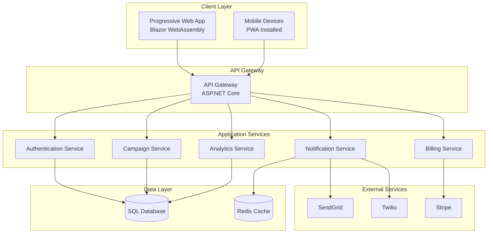
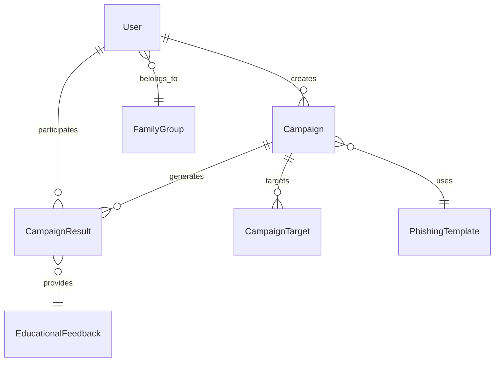

# Phishing Trainer - Project Architecture Summary

## Executive Summary
The Phishing Trainer is a comprehensive Progressive Web Application designed to help non-technical users develop security awareness through safe phishing simulations. The application follows a freemium model with robust features for personal and family use, built on modern Microsoft technology stack.

## Project Overview

### Vision & Mission
**Vision**: Create a safer digital world by empowering individuals with practical security awareness training.

**Mission**: Provide accessible, engaging, and effective phishing awareness training through realistic simulations and personalized feedback.

### Target Audience
- **Primary**: Non-technical individuals aged 25-65
- **Secondary**: Families seeking collective security education
- **Tertiary**: Small businesses looking for employee training

### Value Proposition
- **Safe Learning Environment**: Realistic simulations without real-world risks
- **Personalized Training**: Adaptive difficulty based on user performance
- **Family Protection**: Group training for household security
- **Affordable**: Free tier with premium features for comprehensive training

## Technical Architecture

### Technology Stack
```
Frontend: Blazor WebAssembly (C#)
Backend: ASP.NET Core Web API (C#)
Database: SQL Server with Entity Framework Core
Authentication: ASP.NET Core Identity with JWT
PWA: Service Workers with offline support
Payment: Stripe integration
Email: SendGrid
SMS: Twilio
Hosting: Azure App Service
CI/CD: Azure DevOps
```

### System Architecture Diagram


## Core Features

### 1. Campaign Management
- **Template Library**: Pre-built phishing simulations with varying difficulty
- **Custom Campaigns**: User-created scenarios (Pro tier)
- **Multi-channel**: Email and SMS delivery options
- **Scheduling**: Advanced timing options (Pro tier)
- **Target Management**: Individual and family group targeting

### 2. Tracking & Analytics
- **Real-time Monitoring**: Live campaign progress tracking
- **Comprehensive Metrics**: Open rates, click rates, submission rates
- **Progress Analysis**: User improvement over time
- **Family Analytics**: Group performance comparison
- **Detailed Reports**: Exportable analytics in multiple formats

### 3. Educational Content
- **Instant Feedback**: Post-campaign educational explanations
- **Security Tips**: Contextual advice based on user actions
- **Learning Center**: Comprehensive security awareness resources
- **Personalized Recommendations**: Targeted training suggestions
- **Knowledge Assessment**: Quizzes and skill evaluations

### 4. Subscription Management
- **Free Tier**: Basic campaign creation and results
- **Pro Tier ($10/month)**: Unlimited campaigns, family groups, advanced features
- **Flexible Billing**: Monthly subscription with easy cancellation
- **Feature Gating**: Progressive feature unlock based on subscription

## Security Architecture

### Multi-Layered Security
1. **Network Security**: Firewall, DDoS protection, WAF
2. **Application Security**: Authentication, authorization, input validation
3. **Data Security**: Encryption at rest and in transit
4. **Compliance**: GDPR, PCI DSS adherence

### Key Security Features
- **Enhanced Authentication**: Strong passwords, MFA, session management
- **Data Protection**: Encrypted sensitive data, secure storage
- **Rate Limiting**: Abuse prevention and throttling
- **Audit Logging**: Comprehensive security event tracking
- **Regular Updates**: Security patches and vulnerability management

## Database Design

### Core Entities
- **Users & Authentication**: Identity management with subscription tracking
- **Campaigns**: Simulation configuration and execution
- **Templates**: Reusable phishing scenarios
- **Results**: User interaction tracking and scoring
- **Analytics**: Performance metrics and progress data
- **Family Groups**: Multi-user management for households

### Data Relationships


## Development Strategy

### MVP Timeline (18 Weeks)
1. **Phase 1 (Weeks 1-6)**: Foundation & Core Features
2. **Phase 2 (Weeks 7-10)**: Analytics & Education
3. **Phase 3 (Weeks 11-14)**: Enhanced Features
4. **Phase 4 (Weeks 15-18)**: Monetization & Scale

### Success Metrics
- **User Acquisition**: 100 users in first month
- **Engagement**: 70% campaign completion rate
- **Satisfaction**: 4.0+ user rating
- **Performance**: <3 second page load times
- **Revenue**: $10,000 MRR within 6 months

## Business Model

### Revenue Streams
- **Free Tier**: User acquisition and market penetration
- **Pro Subscription ($10/month)**: Primary revenue source
- **Future**: Enterprise plans, custom templates, consulting

### Market Positioning
- **Competitive Advantage**: Family-focused, user-friendly interface
- **Differentiation**: PWA technology, personalized learning paths
- **Target Market**: Consumer and small business segments

## Deployment & Operations

### Infrastructure
- **Cloud Platform**: Microsoft Azure
- **Scalability**: Auto-scaling web apps and database
- **Monitoring**: Application Insights and custom dashboards
- **Backup**: Automated backups with disaster recovery

### CI/CD Pipeline
- **Source Control**: Azure Repos
- **Build Pipeline**: Automated testing and validation
- **Release Pipeline**: Staging environment validation
- **Monitoring**: Performance and error tracking

## Risk Management

### Technical Risks
- **Third-party Dependencies**: Multiple provider strategies
- **Performance Bottlenecks**: Caching and optimization
- **Security Vulnerabilities**: Regular audits and updates
- **Data Privacy**: Compliance and encryption

### Business Risks
- **Market Adoption**: User research and iterative development
- **Competition**: Unique features and superior UX
- **Regulatory Changes**: Flexible architecture and monitoring
- **Budget Management**: Agile development and regular reviews

## Future Roadmap

### 6-Month Enhancements
- **Mobile Apps**: Native iOS and Android applications
- **AI Integration**: Personalized learning recommendations
- **Advanced Analytics**: Predictive insights and trends
- **Enterprise Features**: Corporate training management

### 12-Month Vision
- **Market Expansion**: Multi-language support
- **Platform Ecosystem**: API for third-party integrations
- **Advanced Gamification**: Achievements and rewards system
- **Partnership Programs**: Integration with security vendors

## Documentation Structure

The complete architecture documentation includes:

1. **[phishing-trainer-architecture.md](phishing-trainer-architecture.md)**: Core system architecture and database design
2. **[system-architecture-diagram.md](system-architecture-diagram.md)**: Visual architecture diagrams and flow charts
3. **[authentication-authorization-system.md](authentication-authorization-system.md)**: Security and access control implementation
4. **[subscription-billing-system.md](subscription-billing-system.md)**: Payment processing and subscription management
5. **[email-sms-campaign-system.md](email-sms-campaign-system.md)**: Campaign simulation and delivery system
6. **[tracking-analytics-system.md](tracking-analytics-system.md)**: Analytics and performance tracking
7. **[pwa-deployment-strategy.md](pwa-deployment-strategy.md)**: Progressive Web App configuration and deployment
8. **[security-data-protection.md](security-data-protection.md)**: Comprehensive security measures and data protection
9. **[development-roadmap-mvp.md](development-roadmap-mvp.md)**: Development timeline and MVP definition

## Conclusion

The Phishing Trainer application represents a comprehensive solution for security awareness training, combining modern technology with user-centric design. The architecture ensures scalability, security, and maintainability while providing an engaging learning experience for users of all technical levels.

The modular design allows for iterative development and feature enhancement, while the robust security framework ensures user data protection and regulatory compliance. The freemium business model provides accessibility while supporting sustainable growth.

With a clear development roadmap and defined success metrics, the project is positioned for successful launch and long-term market impact in the cybersecurity education space.