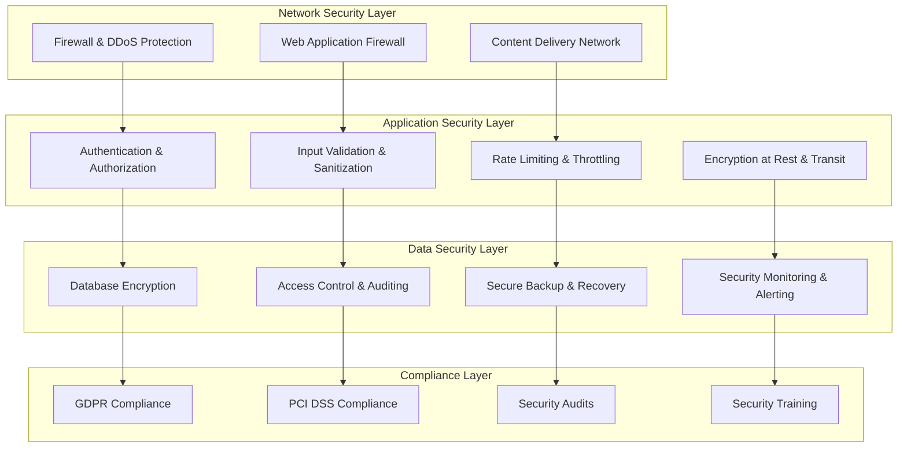

# Security Measures & Data Protection

## Overview
The Phishing Trainer application handles sensitive user data, payment information, and simulates security attacks. This document outlines comprehensive security measures to protect user data, ensure compliance with regulations, and maintain the integrity of the training platform.

## Security Architecture

### Defense in Depth Strategy


## Authentication & Authorization Security

### Enhanced Password Security
```csharp
public class EnhancedPasswordValidator : IPasswordValidator<ApplicationUser>
{
    private readonly ILogger<EnhancedPasswordValidator> _logger;
    private readonly IBreachedPasswordService _breachedPasswordService;

    public async Task<IdentityResult> ValidateAsync(
        UserManager<ApplicationUser> manager, 
        ApplicationUser user, 
        string password)
    {
        var errors = new List<IdentityError>();

        // Check against breached passwords database
        if (await _breachedPasswordService.IsBreachedAsync(password))
        {
            errors.Add(new IdentityError
            {
                Code = "BreachedPassword",
                Description = "This password has been found in data breaches. Please choose a different password."
            });
        }

        // Check for common patterns
        if (ContainsCommonPatterns(password))
        {
            errors.Add(new IdentityError
            {
                Code = "CommonPattern",
                Description = "Password contains common patterns that are easy to guess."
            });
        }

        // Check for personal information
        if (ContainsPersonalInformation(password, user))
        {
            errors.Add(new IdentityError
            {
                Code = "PersonalInfo",
                Description = "Password cannot contain personal information like your name or email."
            });
        }

        // Check password strength
        var strength = CalculatePasswordStrength(password);
        if (strength < PasswordStrength.Medium)
        {
            errors.Add(new IdentityError
            {
                Code = "WeakPassword",
                Description = "Password is too weak. Please include a mix of uppercase, lowercase, numbers, and special characters."
            });
        }

        return errors.Count > 0 ? IdentityResult.Failed(errors.ToArray()) : IdentityResult.Success;
    }

    private bool ContainsCommonPatterns(string password)
    {
        var commonPatterns = new[]
        {
            @"123456", @"password", @"qwerty", @"admin", @"letmein",
            @"welcome", @"monkey", @"dragon", @"master", @"hello"
        };

        return commonPatterns.Any(pattern => 
            password.ToLower().Contains(pattern));
    }

    private bool ContainsPersonalInformation(string password, ApplicationUser user)
    {
        var personalInfo = new[]
        {
            user.FirstName?.ToLower(),
            user.LastName?.ToLower(),
            user.Email?.Split('@')[0]?.ToLower(),
            user.UserName?.ToLower()
        }.Where(info => !string.IsNullOrEmpty(info));

        return personalInfo.Any(info => 
            password.ToLower().Contains(info) && info.Length > 2);
    }

    private PasswordStrength CalculatePasswordStrength(string password)
    {
        var score = 0;

        if (password.Length >= 12) score += 2;
        else if (password.Length >= 8) score += 1;

        if (password.Any(char.IsUpper)) score += 1;
        if (password.Any(char.IsLower)) score += 1;
        if (password.Any(char.IsDigit)) score += 1;
        if (password.Any(c => !char.IsLetterOrDigit(c))) score += 1;

        if (password.Length >= 16) score += 1;

        return score switch
        {
            >= 6 => PasswordStrength.VeryStrong,
            >= 5 => PasswordStrength.Strong,
            >= 4 => PasswordStrength.Medium,
            >= 3 => PasswordStrength.Weak,
            _ => PasswordStrength.VeryWeak
        };
    }
}

public enum PasswordStrength
{
    VeryWeak,
    Weak,
    Medium,
    Strong,
    VeryStrong
}
```

### Multi-Factor Authentication
```csharp
public class EnhancedTwoFactorAuthService
{
    private readonly UserManager<ApplicationUser> _userManager;
    private readonly IEmailSender _emailSender;
    private readonly ISmsService _smsService;
    private readonly ITotpService _totpService;
    private readonly ILogger<EnhancedTwoFactorAuthService> _logger;

    public async Task<TwoFactorSetupResult> SetupTwoFactorAsync(string userId, TwoFactorMethod method)
    {
        var user = await _userManager.FindByIdAsync(userId);
        if (user == null)
            return TwoFactorSetupResult.Failed("User not found");

        try
        {
            switch (method)
            {
                case TwoFactorMethod.Email:
                    return await SetupEmailTwoFactorAsync(user);
                case TwoFactorMethod.Sms:
                    return await SetupSmsTwoFactorAsync(user);
                case TwoFactorMethod.Authenticator:
                    return await SetupAuthenticatorTwoFactorAsync(user);
                default:
                    return TwoFactorSetupResult.Failed("Unsupported method");
            }
        }
        catch (Exception ex)
        {
            _logger.LogError(ex, "Failed to setup 2FA for user {UserId}", userId);
            return TwoFactorSetupResult.Failed("Setup failed");
        }
    }

    private async Task<TwoFactorSetupResult> SetupAuthenticatorTwoFactorAsync(ApplicationUser user)
    {
        var key = await _userManager.GetAuthenticatorKeyAsync(user);
        if (string.IsNullOrEmpty(key))
        {
            await _userManager.ResetAuthenticatorKeyAsync(user);
            key = await _userManager.GetAuthenticatorKeyAsync(user);
        }

        var qrCodeUrl = GenerateQrCodeUrl(key, user.Email);
        var backupCodes = await GenerateBackupCodesAsync(user);

        return TwoFactorSetupResult.Success(key, qrCodeUrl, backupCodes);
    }

    private async Task<List<string>> GenerateBackupCodesAsync(ApplicationUser user)
    {
        var codes = new List<string>();
        var count = 0;

        while (count < 10)
        {
            var code = GenerateBackupCode();
            if (!await _userManager.VerifyTwoFactorTokenAsync(user, "BackupCode", code))
            {
                await _userManager.RegisterTwoFactorProviderAsync(user, "BackupCode", 
                    new PhoneNumberTokenProvider<ApplicationUser>
                    {
                        MessageFormat = "Your backup code is: {0}"
                    });
            }

            codes.Add(code);
            count++;
        }

        return codes;
    }

    private string GenerateBackupCode()
    {
        return Guid.NewGuid().ToString("N")[..8].ToUpper();
    }

    private string GenerateQrCodeUrl(string key, string email)
    {
        return $"otpauth://totp/PhishingTrainer:{email}?secret={key}&issuer=PhishingTrainer";
    }

    public async Task<bool> VerifyTwoFactorCodeAsync(string userId, string code, TwoFactorMethod method)
    {
        var user = await _userManager.FindByIdAsync(userId);
        if (user == null) return false;

        try
        {
            return method switch
            {
                TwoFactorMethod.Email => await _userManager.VerifyTwoFactorTokenAsync(user, "Email", code),
                TwoFactorMethod.Sms => await _userManager.VerifyTwoFactorTokenAsync(user, "Phone", code),
                TwoFactorMethod.Authenticator => await _totpService.VerifyCodeAsync(key, code),
                TwoFactorMethod.BackupCode => await _userManager.VerifyTwoFactorTokenAsync(user, "BackupCode", code),
                _ => false
            };
        }
        catch (Exception ex)
        {
            _logger.LogError(ex, "Failed to verify 2FA code for user {UserId}", userId);
            return false;
        }
    }
}

public enum TwoFactorMethod
{
    Email,
    Sms,
    Authenticator,
    BackupCode
}
```

## Data Protection & Encryption

### Data Encryption Service
```csharp
public class DataEncryptionService
{
    private readonly ILogger<DataEncryptionService> _logger;
    private readonly IConfiguration _config;

    private readonly string _encryptionKey;
    private readonly string _iv;

    public DataEncryptionService(IConfiguration config, ILogger<DataEncryptionService> logger)
    {
        _config = config;
        _logger = logger;
        
        _encryptionKey = _config["Encryption:Key"] ?? throw new InvalidOperationException("Encryption key not configured");
        _iv = _config["Encryption:IV"] ?? throw new InvalidOperationException("Encryption IV not configured");
    }

    public async Task<string> EncryptAsync(string plainText)
    {
        try
        {
            using var aes = Aes.Create();
            aes.Key = Convert.FromBase64String(_encryptionKey);
            aes.IV = Convert.FromBase64String(_iv);

            using var encryptor = aes.CreateEncryptor();
            using var msEncrypt = new MemoryStream();
            using var csEncrypt = new CryptoStream(msEncrypt, encryptor, CryptoStreamMode.Write);
            using (var swEncrypt = new StreamWriter(csEncrypt))
            {
                await swEncrypt.WriteAsync(plainText);
            }

            return Convert.ToBase64String(msEncrypt.ToArray());
        }
        catch (Exception ex)
        {
            _logger.LogError(ex, "Failed to encrypt data");
            throw;
        }
    }

    public async Task<string> DecryptAsync(string cipherText)
    {
        try
        {
            using var aes = Aes.Create();
            aes.Key = Convert.FromBase64String(_encryptionKey);
            aes.IV = Convert.FromBase64String(_iv);

            using var decryptor = aes.CreateDecryptor();
            using var msDecrypt = new MemoryStream(Convert.FromBase64String(cipherText));
            using var csDecrypt = new CryptoStream(msDecrypt, decryptor, CryptoStreamMode.Read);
            using var srDecrypt = new StreamReader(csDecrypt);
            
            return await srDecrypt.ReadToEndAsync();
        }
        catch (Exception ex)
        {
            _logger.LogError(ex, "Failed to decrypt data");
            throw;
        }
    }

    public async Task<string> HashPasswordAsync(string password)
    {
        using var sha256 = SHA256.Create();
        var saltedPassword = password + _config["Encryption:Salt"];
        var hashedBytes = await sha256.ComputeHashAsync(new MemoryStream(Encoding.UTF8.GetBytes(saltedPassword)));
        
        return Convert.ToBase64String(hashedBytes);
    }
}
```

### Sensitive Data Protection
```csharp
public class SensitiveDataProtectionService
{
    private readonly DataEncryptionService _encryptionService;
    private readonly ILogger<SensitiveDataProtectionService> _logger;

    public async Task StoreSensitiveDataAsync(string userId, SensitiveDataType dataType, string data)
    {
        try
        {
            var encryptedData = await _encryptionService.EncryptAsync(data);
            
            var sensitiveRecord = new SensitiveDataRecord
            {
                Id = Guid.NewGuid().ToString(),
                UserId = userId,
                DataType = dataType,
                EncryptedData = encryptedData,
                CreatedAt = DateTime.UtcNow,
                ExpiresAt = DateTime.UtcNow.AddDays(30) // Auto-expire after 30 days
            };

            _context.SensitiveDataRecords.Add(sensitiveRecord);
            await _context.SaveChangesAsync();
        }
        catch (Exception ex)
        {
            _logger.LogError(ex, "Failed to store sensitive data for user {UserId}", userId);
            throw;
        }
    }

    public async Task<string> RetrieveSensitiveDataAsync(string userId, SensitiveDataType dataType)
    {
        try
        {
            var record = await _context.SensitiveDataRecords
                .FirstOrDefaultAsync(r => r.UserId == userId && 
                                       r.DataType == dataType && 
                                       r.ExpiresAt > DateTime.UtcNow);

            if (record == null)
                return null;

            return await _encryptionService.DecryptAsync(record.EncryptedData);
        }
        catch (Exception ex)
        {
            _logger.LogError(ex, "Failed to retrieve sensitive data for user {UserId}", userId);
            throw;
        }
    }

    [AutomaticRetry(Attempts = 3)]
    public async Task CleanupExpiredDataAsync()
    {
        try
        {
            var expiredRecords = await _context.SensitiveDataRecords
                .Where(r => r.ExpiresAt < DateTime.UtcNow)
                .ToListAsync();

            _context.SensitiveDataRecords.RemoveRange(expiredRecords);
            await _context.SaveChangesAsync();

            _logger.LogInformation("Cleaned up {Count} expired sensitive data records", expiredRecords.Count);
        }
        catch (Exception ex)
        {
            _logger.LogError(ex, "Failed to cleanup expired sensitive data");
            throw;
        }
    }
}

public enum SensitiveDataType
{
    PhoneNumber,
    PersonalInfo,
    CampaignResults,
    AnalyticsData
}
```

## API Security

### Rate Limiting & Throttling
```csharp
public class AdvancedRateLimitMiddleware
{
    private readonly RequestDelegate _next;
    private readonly IMemoryCache _cache;
    private readonly ILogger<AdvancedRateLimitMiddleware> _logger;
    private readonly RateLimitOptions _options;

    public async Task InvokeAsync(HttpContext context)
    {
        var clientId = GetClientId(context);
        var endpoint = context.GetEndpoint();
        var rateLimitAttribute = endpoint?.Metadata?.GetMetadata<RateLimitAttribute>();

        if (rateLimitAttribute != null)
        {
            var limit = rateLimitAttribute.Limit;
            var window = rateLimitAttribute.Window;
            var key = $"rate_limit_{clientId}_{endpoint?.DisplayName}";

            if (!await CheckRateLimitAsync(key, limit, window))
            {
                _logger.LogWarning("Rate limit exceeded for client {ClientId} on endpoint {Endpoint}", 
                    clientId, endpoint?.DisplayName);

                context.Response.StatusCode = StatusCodes.Status429TooManyRequests;
                context.Response.Headers.Add("Retry-After", Math.Ceiling(window.TotalSeconds).ToString());
                
                await context.Response.WriteAsync("Rate limit exceeded. Please try again later.");
                return;
            }
        }

        await _next(context);
    }

    private async Task<bool> CheckRateLimitAsync(string key, int limit, TimeSpan window)
    {
        var now = DateTime.UtcNow;
        var cacheEntry = await _cache.GetOrCreateAsync(key, entry =>
        {
            entry.AbsoluteExpirationRelativeToNow = window;
            return Task.FromResult(new RateLimitEntry { Count = 1, WindowStart = now });
        });

        if (now - cacheEntry.WindowStart > window)
        {
            cacheEntry.Count = 1;
            cacheEntry.WindowStart = now;
        }
        else
        {
            cacheEntry.Count++;
        }

        await _cache.SetAsync(key, cacheEntry, window);

        return cacheEntry.Count <= limit;
    }

    private string GetClientId(HttpContext context)
    {
        // Try to get user ID first
        var userId = context.User.FindFirstValue(ClaimTypes.NameIdentifier);
        if (!string.IsNullOrEmpty(userId))
            return $"user_{userId}";

        // Fall back to IP address
        var ipAddress = context.Connection.RemoteIpAddress?.ToString();
        if (!string.IsNullOrEmpty(ipAddress))
            return $"ip_{ipAddress}";

        // Final fallback to session ID
        return $"session_{context.Session.Id}";
    }
}

[AttributeUsage(AttributeTargets.Class | AttributeTargets.Method)]
public class RateLimitAttribute : Attribute
{
    public int Limit { get; set; } = 100;
    public TimeSpan Window { get; set; } = TimeSpan.FromMinutes(1);
}

public class RateLimitEntry
{
    public int Count { get; set; }
    public DateTime WindowStart { get; set; }
}
```

### Input Validation & Sanitization
```csharp
public class SecurityValidationService
{
    private readonly ILogger<SecurityValidationService> _logger;
    private readonly IHtmlSanitizer _htmlSanitizer;

    public ValidationResult ValidateInput(string input, InputType type, int maxLength = 1000)
    {
        if (string.IsNullOrEmpty(input))
            return ValidationResult.Success();

        // Check length
        if (input.Length > maxLength)
        {
            return ValidationResult.Failed($"Input exceeds maximum length of {maxLength} characters");
        }

        // Check for malicious patterns
        if (ContainsMaliciousPatterns(input))
        {
            _logger.LogWarning("Malicious input detected: {Input}", input);
            return ValidationResult.Failed("Input contains potentially malicious content");
        }

        // Type-specific validation
        return type switch
        {
            InputType.Html => ValidateHtmlInput(input),
            InputType.Email => ValidateEmailInput(input),
            InputType.PhoneNumber => ValidatePhoneInput(input),
            InputType.Url => ValidateUrlInput(input),
            _ => ValidateTextInput(input)
        };
    }

    private bool ContainsMaliciousPatterns(string input)
    {
        var maliciousPatterns = new[]
        {
            @"<script[^>]*>.*?</script>",
            @"javascript:",
            @"vbscript:",
            @"onload\s*=",
            @"onerror\s*=",
            @"onclick\s*=",
            @"onmouseover\s*=",
            @"eval\s*\(",
            @"expression\s*\(",
            @"@import",
            @"binding\s*:",
            @"-->", // SQL comment
            @"/\*.*\*/", // SQL comment
            @"union\s+select",
            @"drop\s+table",
            @"insert\s+into",
            @"update\s+set",
            @"delete\s+from"
        };

        return maliciousPatterns.Any(pattern => 
            Regex.IsMatch(input.ToLower(), pattern, RegexOptions.IgnoreCase | RegexOptions.Singleline));
    }

    private ValidationResult ValidateHtmlInput(string input)
    {
        try
        {
            var sanitized = _htmlSanitizer.Sanitize(input);
            
            // Check if sanitization removed content
            if (sanitized.Length != input.Length)
            {
                _logger.LogWarning("HTML input sanitized: {Original} -> {Sanitized}", input, sanitized);
            }

            return ValidationResult.Success(sanitized);
        }
        catch (Exception ex)
        {
            _logger.LogError(ex, "Failed to sanitize HTML input");
            return ValidationResult.Failed("Invalid HTML content");
        }
    }

    private ValidationResult ValidateEmailInput(string input)
    {
        if (!Regex.IsMatch(input, @"^[^@\s]+@[^@\s]+\.[^@\s]+$"))
        {
            return ValidationResult.Failed("Invalid email format");
        }

        return ValidationResult.Success();
    }

    private ValidationResult ValidateUrlInput(string input)
    {
        if (!Uri.TryCreate(input, UriKind.Absolute, out var uri))
        {
            return ValidationResult.Failed("Invalid URL format");
        }

        // Check for dangerous protocols
        var dangerousSchemes = new[] { "javascript", "vbscript", "data", "file" };
        if (dangerousSchemes.Contains(uri.Scheme.ToLower()))
        {
            return ValidationResult.Failed("URL contains dangerous protocol");
        }

        return ValidationResult.Success();
    }
}

public enum InputType
{
    Text,
    Html,
    Email,
    PhoneNumber,
    Url
}

public class ValidationResult
{
    public bool IsValid { get; private set; }
    public string SanitizedValue { get; private set; }
    public string ErrorMessage { get; private set; }

    public static ValidationResult Success(string sanitizedValue = null)
    {
        return new ValidationResult
        {
            IsValid = true,
            SanitizedValue = sanitizedValue
        };
    }

    public static ValidationResult Failed(string errorMessage)
    {
        return new ValidationResult
        {
            IsValid = false,
            ErrorMessage = errorMessage
        };
    }
}
```

## Security Monitoring & Auditing

### Security Event Logging
```csharp
public class SecurityAuditService
{
    private readonly ApplicationDbContext _context;
    private readonly ILogger<SecurityAuditService> _logger;

    public async Task LogSecurityEventAsync(SecurityEvent securityEvent)
    {
        try
        {
            var auditLog = new SecurityAuditLog
            {
                Id = Guid.NewGuid().ToString(),
                EventType = securityEvent.EventType,
                UserId = securityEvent.UserId,
                IpAddress = securityEvent.IpAddress,
                UserAgent = securityEvent.UserAgent,
                Resource = securityEvent.Resource,
                Action = securityEvent.Action,
                Result = securityEvent.Result,
                Details = securityEvent.Details,
                Timestamp = DateTime.UtcNow,
                Severity = securityEvent.Severity
            };

            _context.SecurityAuditLogs.Add(auditLog);
            await _context.SaveChangesAsync();

            // Check for suspicious patterns
            await AnalyzeForSuspiciousActivityAsync(securityEvent);
        }
        catch (Exception ex)
        {
            _logger.LogError(ex, "Failed to log security event");
        }
    }

    private async Task AnalyzeForSuspiciousActivityAsync(SecurityEvent securityEvent)
    {
        // Check for multiple failed logins
        if (securityEvent.EventType == SecurityEventType.LoginFailed)
        {
            var recentFailures = await _context.SecurityAuditLogs
                .CountAsync(l => l.EventType == SecurityEventType.LoginFailed &&
                                l.IpAddress == securityEvent.IpAddress &&
                                l.Timestamp >= DateTime.UtcNow.AddMinutes(-15));

            if (recentFailures >= 5)
            {
                await TriggerSecurityAlertAsync(new SecurityAlert
                {
                    Type = SecurityAlertType.BruteForceAttack,
                    IpAddress = securityEvent.IpAddress,
                    Details = $"Multiple failed login attempts detected: {recentFailures} in 15 minutes",
                    Severity = AlertSeverity.High
                });
            }
        }

        // Check for unusual access patterns
        if (securityEvent.EventType == SecurityEventType.ResourceAccess)
        {
            var recentAccess = await _context.SecurityAuditLogs
                .Where(l => l.UserId == securityEvent.UserId &&
                           l.EventType == SecurityEventType.ResourceAccess &&
                           l.Timestamp >= DateTime.UtcNow.AddHours(-1))
                .GroupBy(l => l.Resource)
                .Select(g => new { Resource = g.Key, Count = g.Count() })
                .ToListAsync();

            foreach (var access in recentAccess)
            {
                if (access.Count > 100) // Unusually high access rate
                {
                    await TriggerSecurityAlertAsync(new SecurityAlert
                    {
                        Type = SecurityAlertType.UnusualAccessPattern,
                        UserId = securityEvent.UserId,
                        Details = $"Unusual access pattern detected: {access.Count} accesses to {access.Resource} in 1 hour",
                        Severity = AlertSeverity.Medium
                    });
                }
            }
        }
    }

    private async Task TriggerSecurityAlertAsync(SecurityAlert alert)
    {
        _logger.LogWarning("Security alert triggered: {Type} - {Details}", alert.Type, alert.Details);

        // Store alert
        _context.SecurityAlerts.Add(new SecurityAlertEntity
        {
            Id = Guid.NewGuid().ToString(),
            Type = alert.Type,
            UserId = alert.UserId,
            IpAddress = alert.IpAddress,
            Details = alert.Details,
            Severity = alert.Severity,
            CreatedAt = DateTime.UtcNow,
            Status = AlertStatus.Active
        });

        await _context.SaveChangesAsync();

        // Send notification to security team
        await NotifySecurityTeamAsync(alert);
    }

    private async Task NotifySecurityTeamAsync(SecurityAlert alert)
    {
        // Implementation for sending alerts to security team
        // Could be email, SMS, Slack, etc.
    }
}

public class SecurityEvent
{
    public SecurityEventType EventType { get; set; }
    public string UserId { get; set; }
    public string IpAddress { get; set; }
    public string UserAgent { get; set; }
    public string Resource { get; set; }
    public string Action { get; set; }
    public SecurityEventResult Result { get; set; }
    public string Details { get; set; }
    public AlertSeverity Severity { get; set; }
}

public enum SecurityEventType
{
    LoginSuccess,
    LoginFailed,
    Logout,
    PasswordChange,
    TwoFactorEnabled,
    TwoFactorDisabled,
    ResourceAccess,
    PermissionChange,
    DataExport,
    ConfigurationChange,
    SuspiciousActivity
}

public enum SecurityEventResult
{
    Success,
    Failure,
    Blocked
}

public enum AlertSeverity
{
    Low,
    Medium,
    High,
    Critical
}
```

## Compliance & Privacy

### GDPR Compliance Service
```csharp
public class GdprComplianceService
{
    private readonly ApplicationDbContext _context;
    private readonly ILogger<GdprComplianceService> _logger;

    public async Task<GdprExportResult> ExportUserDataAsync(string userId)
    {
        try
        {
            var user = await _context.Users.FindAsync(userId);
            if (user == null)
                return GdprExportResult.Failed("User not found");

            var userData = new GdprUserData
            {
                PersonalInformation = new PersonalInfo
                {
                    Id = user.Id,
                    Email = user.Email,
                    FirstName = user.FirstName,
                    LastName = user.LastName,
                    CreatedAt = user.CreatedAt,
                    LastLoginAt = user.LastLoginAt
                },
                Campaigns = await GetUserCampaignsAsync(userId),
                Results = await GetUserResultsAsync(userId),
                Subscription = await GetUserSubscriptionAsync(userId),
                AuditLogs = await GetUserAuditLogsAsync(userId)
            };

            return GdprExportResult.Success(userData);
        }
        catch (Exception ex)
        {
            _logger.LogError(ex, "Failed to export user data for GDPR compliance");
            return GdprExportResult.Failed("Export failed");
        }
    }

    public async Task<GdprDeletionResult> DeleteUserDataAsync(string userId)
    {
        try
        {
            // Start transaction
            using var transaction = await _context.Database.BeginTransactionAsync();

            // Anonymize user data instead of deleting for audit purposes
            var user = await _context.Users.FindAsync(userId);
            if (user == null)
                return GdprDeletionResult.Failed("User not found");

            // Anonymize personal information
            user.Email = $"deleted_{userId}@deleted.com";
            user.FirstName = "Deleted";
            user.LastName = "User";
            user.PhoneNumber = null;
            user.NormalizedEmail = $"DELETED_{userId}@DELETED.COM";
            user.NormalizedUserName = $"DELETED_{USERID}";

            // Mark sensitive data for deletion
            await MarkSensitiveDataForDeletionAsync(userId);

            // Create deletion audit record
            await CreateDeletionAuditRecordAsync(userId);

            await _context.SaveChangesAsync();
            await transaction.CommitAsync();

            return GdprDeletionResult.Success();
        }
        catch (Exception ex)
        {
            _logger.LogError(ex, "Failed to delete user data for GDPR compliance");
            return GdprDeletionResult.Failed("Deletion failed");
        }
    }

    private async Task MarkSensitiveDataForDeletionAsync(string userId)
    {
        var sensitiveData = await _context.SensitiveDataRecords
            .Where(r => r.UserId == userId)
            .ToListAsync();

        foreach (var record in sensitiveData)
        {
            record.ExpiresAt = DateTime.UtcNow.AddDays(30); // Mark for deletion in 30 days
        }
    }

    private async Task CreateDeletionAuditRecordAsync(string userId)
    {
        var auditRecord = new GdprDeletionAudit
        {
            Id = Guid.NewGuid().ToString(),
            UserId = userId,
            DeletionType = GdprDeletionType.RightToBeForgotten,
            DeletionDate = DateTime.UtcNow,
            ProcessedBy = "System"
        };

        _context.GdprDeletionAudits.Add(auditRecord);
    }
}

public class GdprUserData
{
    public PersonalInfo PersonalInformation { get; set; }
    public List<CampaignData> Campaigns { get; set; }
    public List<CampaignResultData> Results { get; set; }
    public SubscriptionData Subscription { get; set; }
    public List<AuditLogData> AuditLogs { get; set; }
}
```

## Infrastructure Security

### Security Headers Middleware
```csharp
public class SecurityHeadersMiddleware
{
    private readonly RequestDelegate _next;
    private readonly SecurityHeadersOptions _options;

    public async Task InvokeAsync(HttpContext context)
    {
        // Add security headers
        if (!context.Response.Headers.ContainsKey("X-Content-Type-Options"))
        {
            context.Response.Headers.Add("X-Content-Type-Options", "nosniff");
        }

        if (!context.Response.Headers.ContainsKey("X-Frame-Options"))
        {
            context.Response.Headers.Add("X-Frame-Options", "DENY");
        }

        if (!context.Response.Headers.ContainsKey("X-XSS-Protection"))
        {
            context.Response.Headers.Add("X-XSS-Protection", "1; mode=block");
        }

        if (!context.Response.Headers.ContainsKey("Referrer-Policy"))
        {
            context.Response.Headers.Add("Referrer-Policy", "strict-origin-when-cross-origin");
        }

        if (!context.Response.Headers.ContainsKey("Content-Security-Policy"))
        {
            var csp = BuildContentSecurityPolicy();
            context.Response.Headers.Add("Content-Security-Policy", csp);
        }

        if (!context.Response.Headers.ContainsKey("Strict-Transport-Security"))
        {
            context.Response.Headers.Add("Strict-Transport-Security", "max-age=31536000; includeSubDomains");
        }

        if (!context.Response.Headers.ContainsKey("Permissions-Policy"))
        {
            context.Response.Headers.Add("Permissions-Policy", 
                "geolocation=(), microphone=(), camera=(), payment=(), usb=(), magnetometer=(), gyroscope=()");
        }

        await _next(context);
    }

    private string BuildContentSecurityPolicy()
    {
        var directives = new List<string>
        {
            "default-src 'self'",
            "script-src 'self' 'unsafe-inline' 'unsafe-eval'", // Required for Blazor
            "style-src 'self' 'unsafe-inline'",
            "img-src 'self' data: https:",
            "font-src 'self' data:",
            "connect-src 'self' https://api.stripe.com",
            "frame-ancestors 'none'",
            "base-uri 'self'",
            "form-action 'self'"
        };

        return string.Join("; ", directives);
    }
}

public class SecurityHeadersOptions
{
    // Configuration options for security headers
}
```

This comprehensive security and data protection framework provides:

1. **Multi-layered security architecture** with defense in depth
2. **Enhanced authentication** with strong password policies and MFA
3. **Data encryption** for sensitive information at rest and in transit
4. **Input validation** and sanitization to prevent injection attacks
5. **Rate limiting** and throttling to prevent abuse
6. **Comprehensive audit logging** and security monitoring
7. **GDPR compliance** with data export and deletion capabilities
8. **Security headers** and content security policies
9. **Automated threat detection** and alerting
10. **Regular security updates** and vulnerability management

The security measures ensure that user data is protected while maintaining the functionality needed for effective phishing awareness training.