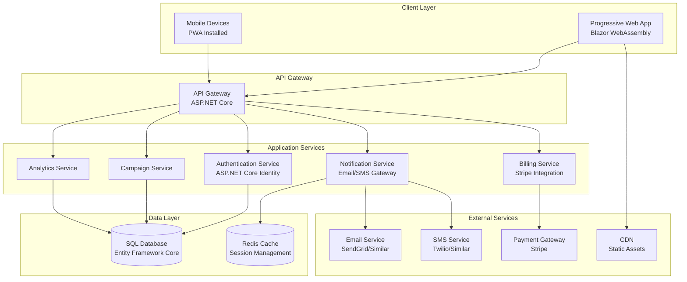
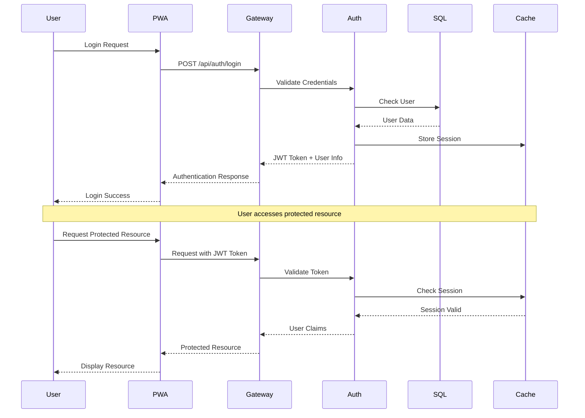
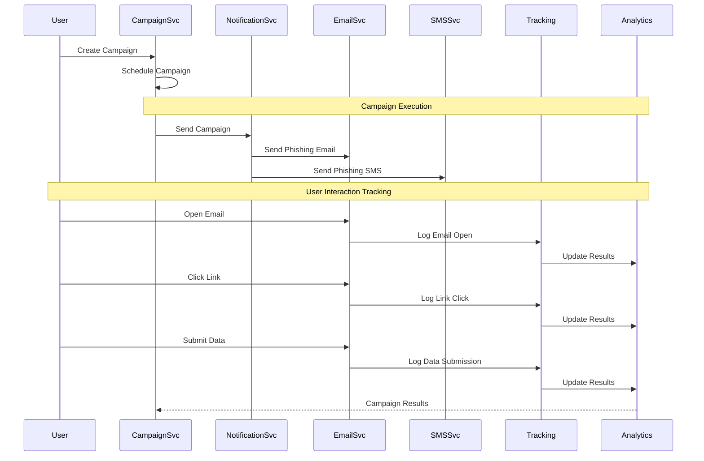
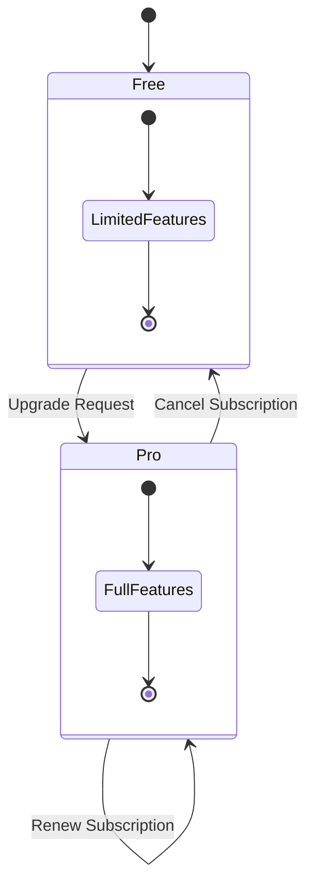
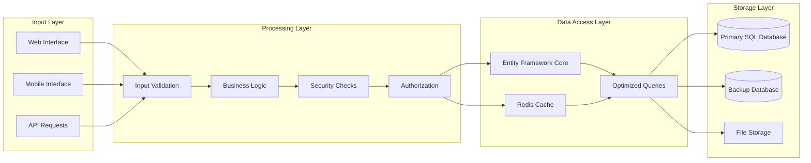
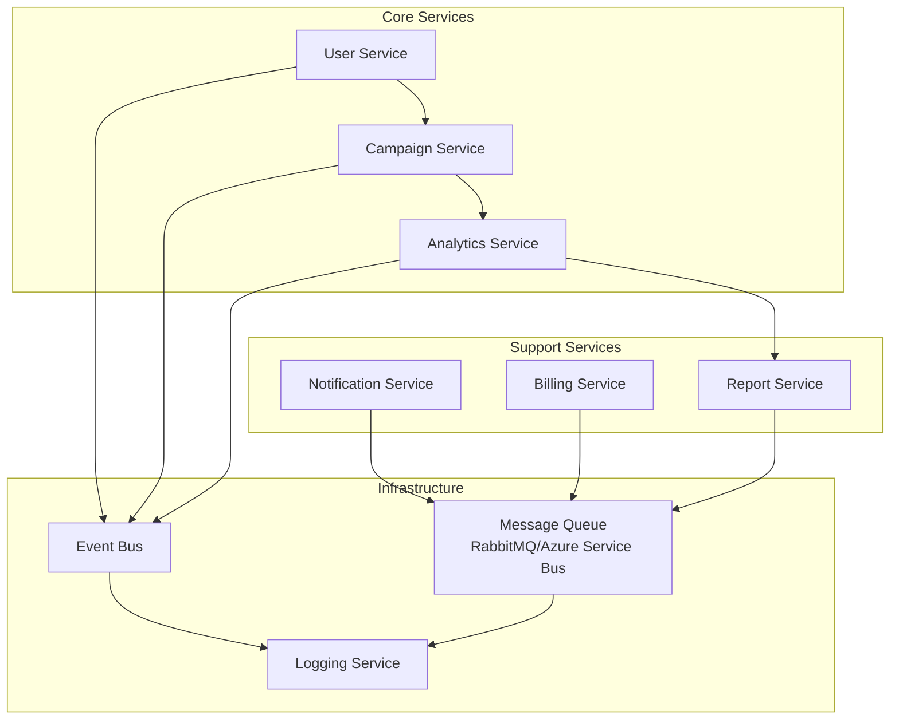
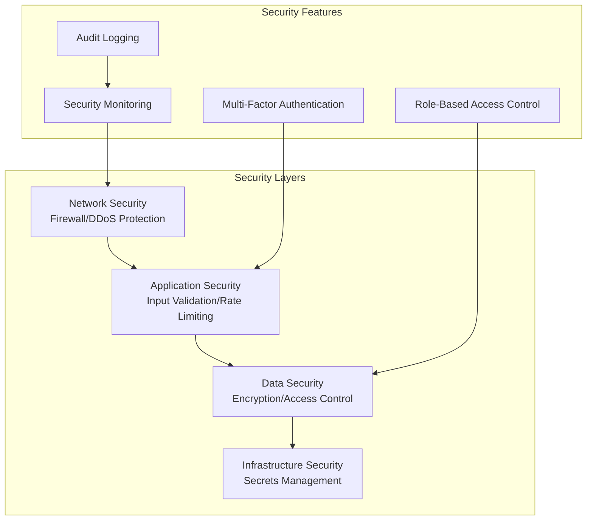

# Phishing Trainer System Architecture Diagram

## High-Level Architecture



## Authentication & Authorization Flow



## Campaign Execution Flow



## Subscription Management Flow



## Data Flow Architecture



## Microservices Communication



## Security Architecture



## Deployment Architecture

```mermaid
graph TB
    subgraph "Production Environment"
        subgraph "Web Tier"
            LB[Load Balancer]
            App1[App Instance 1]
            App2[App Instance 2]
            App3[App Instance 3]
        end
        
        subgraph "Data Tier"
            SQLPrimary[(SQL Primary)]
            SQLSecondary[(SQL Secondary)]
            RedisCluster[(Redis Cluster)]
        end
        
        subgraph "Services"
            EmailService[Email Service]
            SMSService[SMS Service]
            PaymentService[Payment Service]
        end
    end
    
    subgraph "CDN & Static"
        CDN[CDN]
        StaticAssets[Static Assets]
    end
    
    LB --> App1
    LB --> App2
    LB --> App3
    
    App1 --> SQLPrimary
    App2 --> SQLPrimary
    App3 --> SQLPrimary
    
    SQLPrimary --> SQLSecondary
    App1 --> RedisCluster
    App2 --> RedisCluster
    App3 --> RedisCluster
    
    App1 --> EmailService
    App2 --> SMSService
    App3 --> PaymentService
    
    CDN --> StaticAssets