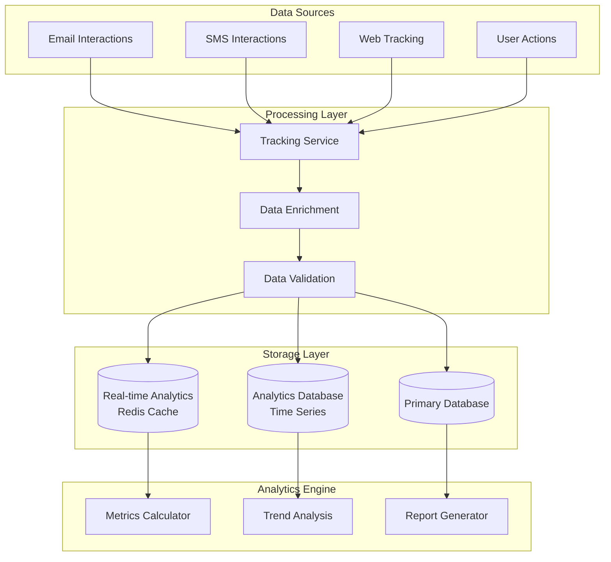

# Tracking & Analytics System

## Overview
The tracking and analytics system provides comprehensive insights into campaign performance, user behavior patterns, and security awareness improvement over time. It collects detailed interaction data and presents it through intuitive dashboards and reports.

## Analytics Architecture

### Data Collection Pipeline


### Analytics Service Implementation
```csharp
public class AnalyticsService
{
    private readonly ApplicationDbContext _context;
    private readonly ICacheService _cacheService;
    private readonly ILogger<AnalyticsService> _logger;

    public async Task<CampaignAnalytics> GetCampaignAnalyticsAsync(string campaignId)
    {
        var cacheKey = $"campaign_analytics_{campaignId}";
        var cached = await _cacheService.GetAsync<CampaignAnalytics>(cacheKey);
        
        if (cached != null)
            return cached;

        var campaign = await _context.Campaigns
            .Include(c => c.Results)
            .Include(c => c.Targets)
            .FirstOrDefaultAsync(c => c.Id == campaignId);

        if (campaign == null)
            return null;

        var analytics = new CampaignAnalytics
        {
            CampaignId = campaignId,
            CampaignName = campaign.Name,
            TotalTargets = campaign.Targets.Count,
            SentEmails = campaign.Targets.Count(t => t.EmailSent),
            SentSms = campaign.Targets.Count(t => t.SmsSent),
            Results = await ProcessCampaignResultsAsync(campaign.Results),
            Timeline = await GenerateCampaignTimelineAsync(campaignId),
            PerformanceMetrics = CalculatePerformanceMetrics(campaign.Results)
        };

        // Cache for 15 minutes
        await _cacheService.SetAsync(cacheKey, analytics, TimeSpan.FromMinutes(15));
        
        return analytics;
    }

    public async Task<UserAnalytics> GetUserAnalyticsAsync(string userId, DateTime? startDate = null, DateTime? endDate = null)
    {
        var start = startDate ?? DateTime.UtcNow.AddDays(-90);
        var end = endDate ?? DateTime.UtcNow;

        var userResults = await _context.CampaignResults
            .Include(r => r.Campaign)
            .Where(r => r.UserId == userId && r.Campaign.StartedAt >= start && r.Campaign.StartedAt <= end)
            .ToListAsync();

        var analytics = new UserAnalytics
        {
            UserId = userId,
            PeriodStart = start,
            PeriodEnd = end,
            TotalCampaigns = userResults.Select(r => r.CampaignId).Distinct().Count(),
            AverageScore = userResults.Any() ? userResults.Average(r => r.Score) : 0,
            ImprovementTrend = CalculateImprovementTrend(userResults),
            VulnerabilityAreas = IdentifyVulnerabilityAreas(userResults),
            StrengthAreas = IdentifyStrengthAreas(userResults),
            ProgressOverTime = await GenerateProgressTimelineAsync(userId, start, end),
            Recommendations = GeneratePersonalizedRecommendations(userResults)
        };

        return analytics;
    }

    public async Task<FamilyAnalytics> GetFamilyAnalyticsAsync(string familyGroupId, DateTime? startDate = null, DateTime? endDate = null)
    {
        var start = startDate ?? DateTime.UtcNow.AddDays(-90);
        var end = endDate ?? DateTime.UtcNow;

        var familyMembers = await _context.Users
            .Where(u => u.FamilyGroupId == familyGroupId)
            .ToListAsync();

        var memberIds = familyMembers.Select(m => m.Id).ToList();
        var familyResults = await _context.CampaignResults
            .Include(r => r.Campaign)
            .Include(r => r.User)
            .Where(r => memberIds.Contains(r.UserId) && r.Campaign.StartedAt >= start && r.Campaign.StartedAt <= end)
            .ToListAsync();

        var analytics = new FamilyAnalytics
        {
            FamilyGroupId = familyGroupId,
            PeriodStart = start,
            PeriodEnd = end,
            MemberCount = familyMembers.Count,
            MemberAnalytics = familyMembers.ToDictionary(
                m => m.Id,
                m => new MemberSummary
                {
                    Name = $"{m.FirstName} {m.LastName}",
                    AverageScore = familyResults.Where(r => r.UserId == m.Id).DefaultIfEmpty().Average(r => r?.Score ?? 0),
                    CampaignsParticipated = familyResults.Count(r => r.UserId == m.Id),
                    LastActivity = familyResults.Where(r => r.UserId == m.Id).Max(r => (DateTime?)r.EmailOpenedAt) ?? 
                                   familyResults.Where(r => r.UserId == m.Id).Max(r => (DateTime?)r.LinkClickedAt)
                }
            ),
            FamilyAverageScore = familyResults.Any() ? familyResults.Average(r => r.Score) : 0,
            CollectiveImprovement = CalculateFamilyImprovement(familyResults),
            VulnerabilityComparison = CompareFamilyVulnerabilities(familyResults),
            RecommendedTraining = GenerateFamilyRecommendations(familyResults)
        };

        return analytics;
    }

    private async Task<List<CampaignResultSummary>> ProcessCampaignResultsAsync(IEnumerable<CampaignResult> results)
    {
        var summary = new List<CampaignResultSummary>();

        var groupedResults = results.GroupBy(r => r.Result);
        
        foreach (var group in groupedResults)
        {
            summary.Add(new CampaignResultSummary
            {
                ResultType = group.Key,
                Count = group.Count(),
                Percentage = results.Any() ? (double)group.Count() / results.Count() * 100 : 0,
                AverageTimeToAction = CalculateAverageTimeToAction(group.ToList())
            });
        }

        return summary;
    }

    private CampaignPerformanceMetrics CalculatePerformanceMetrics(IEnumerable<CampaignResult> results)
    {
        var resultsList = results.ToList();
        
        return new CampaignPerformanceMetrics
        {
            OpenRate = CalculateOpenRate(resultsList),
            ClickRate = CalculateClickRate(resultsList),
            SubmissionRate = CalculateSubmissionRate(resultsList),
            ReportingRate = CalculateReportingRate(resultsList),
            RiskScore = CalculateOverallRiskScore(resultsList),
            EffectivenessScore = CalculateEffectivenessScore(resultsList)
        };
    }

    private double CalculateOpenRate(List<CampaignResult> results)
    {
        var opened = results.Count(r => r.EmailOpenedAt != default);
        var delivered = results.Count(r => r.Result != ResultType.NotDelivered);
        return delivered > 0 ? (double)opened / delivered * 100 : 0;
    }

    private double CalculateClickRate(List<CampaignResult> results)
    {
        var clicked = results.Count(r => r.LinkClickedAt != default);
        var opened = results.Count(r => r.EmailOpenedAt != default);
        return opened > 0 ? (double)clicked / opened * 100 : 0;
    }

    private double CalculateSubmissionRate(List<CampaignResult> results)
    {
        var submitted = results.Count(r => r.Result == ResultType.SubmittedData);
        var clicked = results.Count(r => r.LinkClickedAt != default);
        return clicked > 0 ? (double)submitted / clicked * 100 : 0;
    }

    private double CalculateReportingRate(List<CampaignResult> results)
    {
        var reported = results.Count(r => r.Result == ResultType.ReportedAsPhishing);
        var delivered = results.Count(r => r.Result != ResultType.NotDelivered);
        return delivered > 0 ? (double)reported / delivered * 100 : 0;
    }

    private int CalculateOverallRiskScore(List<CampaignResult> results)
    {
        if (!results.Any()) return 0;
        
        var averageScore = results.Average(r => r.Score);
        var submissionRate = CalculateSubmissionRate(results);
        var clickRate = CalculateClickRate(results);
        
        // Weighted risk score (higher is more vulnerable)
        return (int)((averageScore * 0.4) + (submissionRate * 0.4) + (clickRate * 0.2));
    }

    private int CalculateEffectivenessScore(List<CampaignResult> results)
    {
        if (!results.Any()) return 0;
        
        var reportingRate = CalculateReportingRate(results);
        var nonClickRate = 100 - CalculateClickRate(results);
        var nonSubmissionRate = 100 - CalculateSubmissionRate(results);
        
        // Effectiveness score (higher is better - more security aware)
        return (int)((reportingRate * 0.5) + (nonClickRate * 0.3) + (nonSubmissionRate * 0.2));
    }
}
```

## Real-time Analytics

### Live Dashboard Service
```csharp
public class LiveAnalyticsService
{
    private readonly IConnectionManager _connectionManager;
    private readonly ICacheService _cacheService;
    private readonly ILogger<LiveAnalyticsService> _logger;

    public async Task StartLiveUpdatesAsync(string campaignId, HubCallerContext context)
    {
        await _connectionManager.AddToGroupAsync(context.ConnectionId, $"campaign_{campaignId}");
        
        // Send initial data
        var initialData = await GetRealTimeCampaignDataAsync(campaignId);
        await _connectionManager.Clients.Group($"campaign_{campaignId}")
            .SendAsync("CampaignUpdate", initialData);
    }

    public async Task NotifyCampaignUpdateAsync(string campaignId, CampaignUpdate update)
    {
        var cacheKey = $"campaign_live_{campaignId}";
        await _cacheService.SetAsync(cacheKey, update, TimeSpan.FromMinutes(5));
        
        await _connectionManager.Clients.Group($"campaign_{campaignId}")
            .SendAsync("CampaignUpdate", update);
    }

    private async Task<CampaignLiveUpdate> GetRealTimeCampaignDataAsync(string campaignId)
    {
        var cacheKey = $"campaign_live_{campaignId}";
        var cached = await _cacheService.GetAsync<CampaignLiveUpdate>(cacheKey);
        
        if (cached != null)
            return cached;

        // Calculate real-time metrics
        var results = await _context.CampaignResults
            .Where(r => r.CampaignId == campaignId)
            .ToListAsync();

        var update = new CampaignLiveUpdate
        {
            CampaignId = campaignId,
            Timestamp = DateTime.UtcNow,
            TotalSent = await GetTotalSentAsync(campaignId),
            OpenedCount = results.Count(r => r.EmailOpenedAt != default),
            ClickedCount = results.Count(r => r.LinkClickedAt != default),
            SubmittedCount = results.Count(r => r.Result == ResultType.SubmittedData),
            ReportedCount = results.Count(r => r.Result == ResultType.ReportedAsPhishing),
            RecentActivity = await GetRecentActivityAsync(campaignId, TimeSpan.FromMinutes(15))
        };

        await _cacheService.SetAsync(cacheKey, update, TimeSpan.FromMinutes(5));
        return update;
    }

    private async Task<List<ActivityEvent>> GetRecentActivityAsync(string campaignId, TimeSpan timeWindow)
    {
        var cutoff = DateTime.UtcNow.Subtract(timeWindow);
        
        var results = await _context.CampaignResults
            .Include(r => r.User)
            .Where(r => r.CampaignId == campaignId && 
                       (r.EmailOpenedAt >= cutoff || 
                        r.LinkClickedAt >= cutoff || 
                        r.DataSubmittedAt >= cutoff))
            .ToListAsync();

        var activities = new List<ActivityEvent>();

        foreach (var result in results)
        {
            if (result.EmailOpenedAt >= cutoff)
            {
                activities.Add(new ActivityEvent
                {
                    Type = "Email Opened",
                    UserId = result.UserId,
                    UserName = $"{result.User.FirstName} {result.User.LastName}",
                    Timestamp = result.EmailOpenedAt,
                    Severity = "Medium"
                });
            }

            if (result.LinkClickedAt >= cutoff)
            {
                activities.Add(new ActivityEvent
                {
                    Type = "Link Clicked",
                    UserId = result.UserId,
                    UserName = $"{result.User.FirstName} {result.User.LastName}",
                    Timestamp = result.LinkClickedAt,
                    Severity = "High"
                });
            }

            if (result.DataSubmittedAt >= cutoff)
            {
                activities.Add(new ActivityEvent
                {
                    Type = "Data Submitted",
                    UserId = result.UserId,
                    UserName = $"{result.User.FirstName} {result.User.LastName}",
                    Timestamp = result.DataSubmittedAt,
                    Severity = "Critical"
                });
            }
        }

        return activities.OrderByDescending(a => a.Timestamp).ToList();
    }
}
```

## Reporting System

### Report Generation Service
```csharp
public class ReportService
{
    private readonly AnalyticsService _analyticsService;
    private readonly IReportTemplateEngine _templateEngine;
    private readonly IPdfGenerator _pdfGenerator;
    private readonly IEmailService _emailService;

    public async Task<ReportResult> GenerateCampaignReportAsync(string campaignId, ReportFormat format)
    {
        var analytics = await _analyticsService.GetCampaignAnalyticsAsync(campaignId);
        if (analytics == null)
            return ReportResult.Failed("Campaign not found");

        var reportData = new CampaignReportData
        {
            Analytics = analytics,
            GeneratedAt = DateTime.UtcNow,
            Recommendations = GenerateCampaignRecommendations(analytics),
            ExecutiveSummary = GenerateExecutiveSummary(analytics)
        };

        switch (format)
        {
            case ReportFormat.Pdf:
                return await GeneratePdfReportAsync(reportData);
            case ReportFormat.Excel:
                return await GenerateExcelReportAsync(reportData);
            case ReportFormat.Html:
                return await GenerateHtmlReportAsync(reportData);
            default:
                return ReportResult.Failed("Unsupported format");
        }
    }

    public async Task<ReportResult> GenerateUserProgressReportAsync(string userId, DateTime startDate, DateTime endDate)
    {
        var analytics = await _analyticsService.GetUserAnalyticsAsync(userId, startDate, endDate);
        
        var reportData = new UserProgressReportData
        {
            Analytics = analytics,
            GeneratedAt = DateTime.UtcNow,
            DetailedBreakdown = await GenerateDetailedBreakdownAsync(userId, startDate, endDate),
            ComparisonWithPeers = await GeneratePeerComparisonAsync(userId),
            ActionableInsights = GenerateActionableInsights(analytics)
        };

        return await GeneratePdfReportAsync(reportData);
    }

    private async Task<ReportResult> GeneratePdfReportAsync<T>(T reportData) where T : class
    {
        try
        {
            var htmlContent = await _templateEngine.RenderTemplateAsync($"{typeof(T).Name}.cshtml", reportData);
            var pdfBytes = await _pdfGenerator.GeneratePdfAsync(htmlContent);
            
            var fileName = $"{typeof(T).Name}_{DateTime.UtcNow:yyyyMMdd_HHmmss}.pdf";
            
            return ReportResult.Success(fileName, pdfBytes, "application/pdf");
        }
        catch (Exception ex)
        {
            _logger.LogError(ex, "Failed to generate PDF report");
            return ReportResult.Failed("Failed to generate PDF report");
        }
    }

    private async Task<ReportResult> GenerateExcelReportAsync(CampaignReportData reportData)
    {
        try
        {
            using var package = new ExcelPackage();
            var worksheet = package.Workbook.Worksheets.Add("Campaign Analytics");

            // Add summary data
            worksheet.Cells["A1"].Value = "Campaign Analytics Report";
            worksheet.Cells["A1"].Style.Font.Bold = true;
            worksheet.Cells["A1"].Style.Font.Size = 16;

            worksheet.Cells["A3"].Value = "Campaign Name:";
            worksheet.Cells["B3"].Value = reportData.Analytics.CampaignName;
            
            worksheet.Cells["A4"].Value = "Total Targets:";
            worksheet.Cells["B4"].Value = reportData.Analytics.TotalTargets;

            worksheet.Cells["A5"].Value = "Generated At:";
            worksheet.Cells["B5"].Value = reportData.GeneratedAt.ToString("yyyy-MM-dd HH:mm:ss");

            // Add results breakdown
            worksheet.Cells["A7"].Value = "Results Breakdown";
            worksheet.Cells["A7"].Style.Font.Bold = true;

            var row = 8;
            foreach (var result in reportData.Analytics.Results)
            {
                worksheet.Cells[$"A{row}"].Value = result.ResultType.ToString();
                worksheet.Cells[$"B{row}"].Value = result.Count;
                worksheet.Cells[$"C{row}"].Value = result.Percentage.ToString("F2") + "%";
                row++;
            }

            // Add performance metrics
            worksheet.Cells["E7"].Value = "Performance Metrics";
            worksheet.Cells["E7"].Style.Font.Bold = true;

            worksheet.Cells["E8"].Value = "Open Rate:";
            worksheet.Cells["F8"].Value = reportData.Analytics.PerformanceMetrics.OpenRate.ToString("F2") + "%";
            
            worksheet.Cells["E9"].Value = "Click Rate:";
            worksheet.Cells["F9"].Value = reportData.Analytics.PerformanceMetrics.ClickRate.ToString("F2") + "%";
            
            worksheet.Cells["E10"].Value = "Submission Rate:";
            worksheet.Cells["F10"].Value = reportData.Analytics.PerformanceMetrics.SubmissionRate.ToString("F2") + "%";

            worksheet.Cells.AutoFitColumns();

            var excelBytes = package.GetAsByteArray();
            var fileName = $"Campaign_Analytics_{DateTime.UtcNow:yyyyMMdd_HHmmss}.xlsx";
            
            return ReportResult.Success(fileName, excelBytes, "application/vnd.openxmlformats-officedocument.spreadsheetml.sheet");
        }
        catch (Exception ex)
        {
            _logger.LogError(ex, "Failed to generate Excel report");
            return ReportResult.Failed("Failed to generate Excel report");
        }
    }

    private List<string> GenerateCampaignRecommendations(CampaignAnalytics analytics)
    {
        var recommendations = new List<string>();

        if (analytics.PerformanceMetrics.OpenRate > 70)
        {
            recommendations.Add("High open rate indicates subjects are convincing. Consider this for future awareness training.");
        }

        if (analytics.PerformanceMetrics.ClickRate > 50)
        {
            recommendations.Add("High click rate suggests users need more training on identifying suspicious links.");
        }

        if (analytics.PerformanceMetrics.SubmissionRate > 20)
        {
            recommendations.Add("High submission rate indicates critical need for data protection awareness training.");
        }

        if (analytics.PerformanceMetrics.ReportingRate < 10)
        {
            recommendations.Add("Low reporting rate suggests users need training on how to report phishing attempts.");
        }

        return recommendations;
    }

    private string GenerateExecutiveSummary(CampaignAnalytics analytics)
    {
        var summary = new StringBuilder();
        
        summary.AppendLine($"Campaign '{analytics.CampaignName}' reached {analytics.TotalTargets} targets. ");
        summary.AppendLine($"Open rate: {analytics.PerformanceMetrics.OpenRate:F1}%, ");
        summary.AppendLine($"Click rate: {analytics.PerformanceMetrics.ClickRate:F1}%, ");
        summary.AppendLine($"Submission rate: {analytics.PerformanceMetrics.SubmissionRate:F1}%. ");
        
        if (analytics.PerformanceMetrics.RiskScore > 70)
        {
            summary.AppendLine("High risk score indicates significant vulnerability requiring immediate attention.");
        }
        else if (analytics.PerformanceMetrics.RiskScore > 40)
        {
            summary.AppendLine("Moderate risk score suggests need for continued security awareness training.");
        }
        else
        {
            summary.AppendLine("Low risk score indicates good security awareness among participants.");
        }

        return summary.ToString();
    }
}
```

## Analytics Dashboard Components

### Frontend Analytics Components
```razor
@page "/analytics/dashboard"
@inject IAnalyticsService AnalyticsService
@inject IJSRuntime JSRuntime

<h3>Analytics Dashboard</h3>

<div class="dashboard-grid">
    <div class="metric-card">
        <h4>Campaign Overview</h4>
        <div class="metric-value">@totalCampaigns</div>
        <div class="metric-label">Total Campaigns</div>
    </div>

    <div class="metric-card">
        <h4>Average Risk Score</h4>
        <div class="metric-value @(riskScoreClass)">@averageRiskScore</div>
        <div class="metric-label">Overall Risk Level</div>
    </div>

    <div class="metric-card">
        <h4>Improvement Rate</h4>
        <div class="metric-value @(improvementClass)">@improvementRate%</div>
        <div class="metric-label">30-Day Improvement</div>
    </div>
</div>

<div class="chart-container">
    <h4>Campaign Performance Trend</h4>
    <canvas id="performanceChart"></canvas>
</div>

<div class="chart-container">
    <h4>Result Distribution</h4>
    <canvas id="resultsChart"></canvas>
</div>

<div class="recent-activity">
    <h4>Recent Activity</h4>
    <table class="activity-table">
        <thead>
            <tr>
                <th>Time</th>
                <th>User</th>
                <th>Action</th>
                <th>Severity</th>
            </tr>
        </thead>
        <tbody>
            @foreach (var activity in recentActivities)
            {
                <tr class="activity-@activity.Severity.ToLower()">
                    <td>@activity.Timestamp.ToString("HH:mm")</td>
                    <td>@activity.UserName</td>
                    <td>@activity.Type</td>
                    <td>@activity.Severity</td>
                </tr>
            }
        </tbody>
    </table>
</div>

@code {
    private int totalCampaigns;
    private int averageRiskScore;
    private string riskScoreClass;
    private int improvementRate;
    private string improvementClass;
    private List<ActivityEvent> recentActivities;

    protected override async Task OnInitializedAsync()
    {
        await LoadDashboardData();
    }

    private async Task LoadDashboardData()
    {
        var userId = await GetCurrentUserAsync();
        var analytics = await AnalyticsService.GetUserAnalyticsAsync(userId);
        
        totalCampaigns = analytics.TotalCampaigns;
        averageRiskScore = (int)(100 - analytics.AverageScore);
        riskScoreClass = averageRiskScore > 70 ? "high-risk" : averageRiskScore > 40 ? "medium-risk" : "low-risk";
        improvementRate = (int)analytics.ImprovementTrend;
        improvementClass = improvementRate > 0 ? "positive" : "negative";
        
        recentActivities = await AnalyticsService.GetRecentActivityAsync(userId, TimeSpan.FromHours(24));

        // Render charts
        await JSRuntime.InvokeVoidAsync("renderPerformanceChart", analytics.ProgressOverTime);
        await JSRuntime.InvokeVoidAsync("renderResultsChart", analytics.VulnerabilityAreas);
    }
}
```

## Data Models

### Analytics Data Models
```csharp
public class CampaignAnalytics
{
    public string CampaignId { get; set; }
    public string CampaignName { get; set; }
    public int TotalTargets { get; set; }
    public int SentEmails { get; set; }
    public int SentSms { get; set; }
    public List<CampaignResultSummary> Results { get; set; }
    public List<TimelineEvent> Timeline { get; set; }
    public CampaignPerformanceMetrics PerformanceMetrics { get; set; }
}

public class CampaignResultSummary
{
    public ResultType ResultType { get; set; }
    public int Count { get; set; }
    public double Percentage { get; set; }
    public TimeSpan AverageTimeToAction { get; set; }
}

public class CampaignPerformanceMetrics
{
    public double OpenRate { get; set; }
    public double ClickRate { get; set; }
    public double SubmissionRate { get; set; }
    public double ReportingRate { get; set; }
    public int RiskScore { get; set; }
    public int EffectivenessScore { get; set; }
}

public class UserAnalytics
{
    public string UserId { get; set; }
    public DateTime PeriodStart { get; set; }
    public DateTime PeriodEnd { get; set; }
    public int TotalCampaigns { get; set; }
    public double AverageScore { get; set; }
    public double ImprovementTrend { get; set; }
    public Dictionary<string, double> VulnerabilityAreas { get; set; }
    public Dictionary<string, double> StrengthAreas { get; set; }
    public List<ProgressPoint> ProgressOverTime { get; set; }
    public List<string> Recommendations { get; set; }
}

public class FamilyAnalytics
{
    public string FamilyGroupId { get; set; }
    public DateTime PeriodStart { get; set; }
    public DateTime PeriodEnd { get; set; }
    public int MemberCount { get; set; }
    public Dictionary<string, MemberSummary> MemberAnalytics { get; set; }
    public double FamilyAverageScore { get; set; }
    public double CollectiveImprovement { get; set; }
    public Dictionary<string, double> VulnerabilityComparison { get; set; }
    public List<string> RecommendedTraining { get; set; }
}

public class MemberSummary
{
    public string Name { get; set; }
    public double AverageScore { get; set; }
    public int CampaignsParticipated { get; set; }
    public DateTime? LastActivity { get; set; }
}

public class ActivityEvent
{
    public string Type { get; set; }
    public string UserId { get; set; }
    public string UserName { get; set; }
    public DateTime Timestamp { get; set; }
    public string Severity { get; set; }
}

public class CampaignLiveUpdate
{
    public string CampaignId { get; set; }
    public DateTime Timestamp { get; set; }
    public int TotalSent { get; set; }
    public int OpenedCount { get; set; }
    public int ClickedCount { get; set; }
    public int SubmittedCount { get; set; }
    public int ReportedCount { get; set; }
    public List<ActivityEvent> RecentActivity { get; set; }
}
```

This tracking and analytics system provides:

1. **Comprehensive campaign analytics** with detailed performance metrics
2. **Real-time monitoring** with live dashboard updates
3. **User progress tracking** with improvement trends over time
4. **Family group analytics** for comparing security awareness
5. **Automated report generation** in multiple formats (PDF, Excel, HTML)
6. **Interactive dashboards** with visual charts and activity feeds
7. **Actionable insights** and personalized recommendations
8. **Trend analysis** to identify patterns and areas for improvement

The system transforms raw interaction data into meaningful insights that help users understand their security awareness progress and identify areas where additional training is needed.